# Diagrammi Architettura - Agente RAG Chatbot

## Indice
1. [Architettura Generale](#architettura-generale)
2. [Flusso RAG Semplice](#flusso-rag-semplice)
3. [Flusso RAG Avanzato](#flusso-rag-avanzato)
4. [Data Flow](#data-flow)
5. [Deployment Architecture](#deployment-architecture)
6. [Monitoring Stack](#monitoring-stack)

---

## Architettura Generale

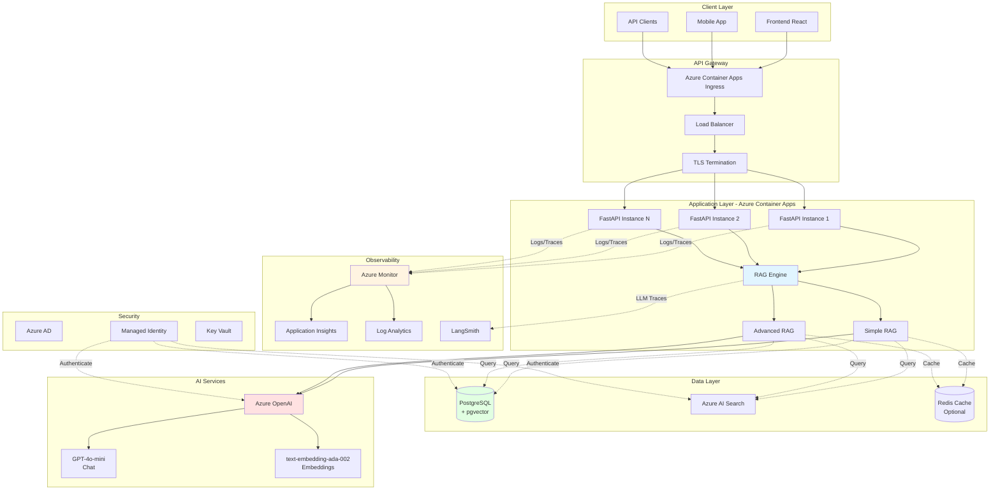

---

## Flusso RAG Semplice (SimpleRAGChat)

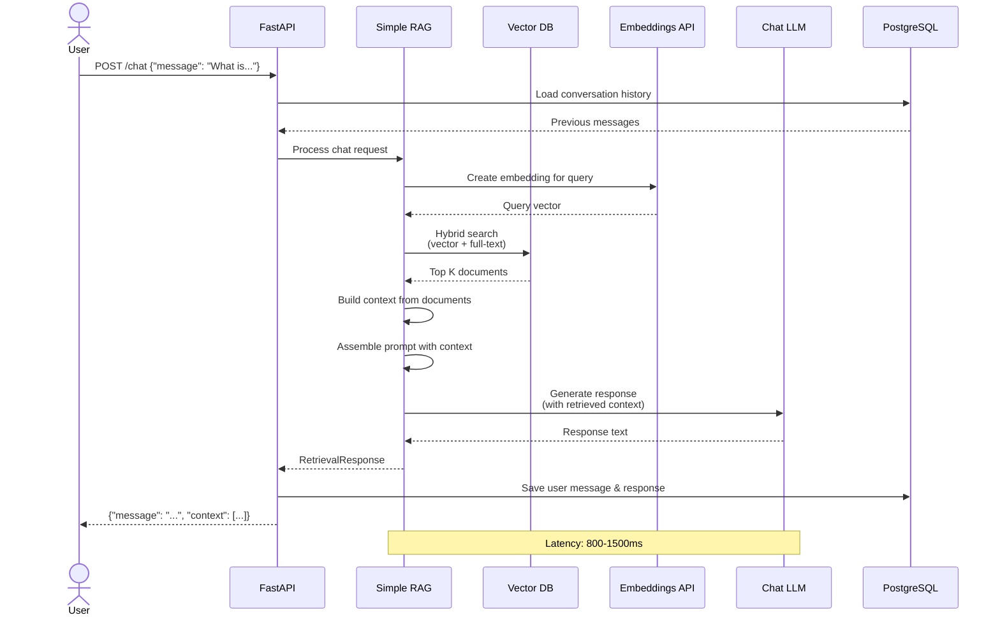

### Caratteristiche SimpleRAG
- **Latenza:** 800-1500ms
- **Costo:** ~$0.002-0.005 per richiesta
- **Use Case:** FAQ, ricerca documenti, Q&A dirette
- **Token Usage:** 500-1500 tokens/richiesta

---

## Flusso RAG Avanzato (AdvancedRAGChat)

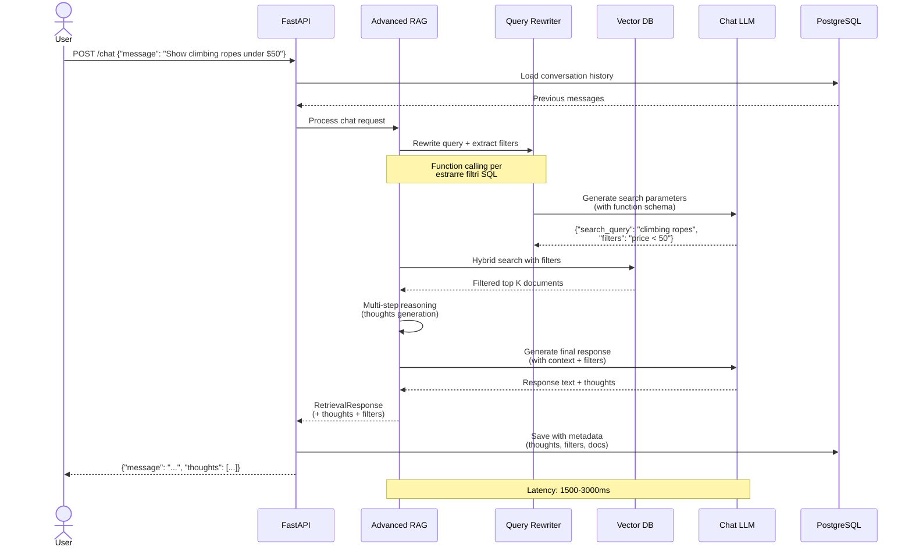

### Caratteristiche AdvancedRAG
- **Latenza:** 1500-3000ms (doppia chiamata LLM)
- **Costo:** ~$0.005-0.012 per richiesta
- **Use Case:** Analisi complesse, filtri dinamici, reasoning multi-step
- **Token Usage:** 1000-3000 tokens/richiesta
- **Features:** Query rewriting, function calling, thought tracking

---

## Data Flow - Document Ingestion

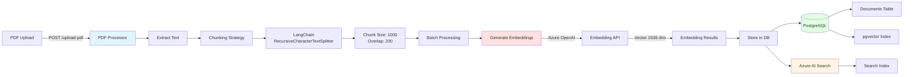

### Pipeline Steps
1. **Upload:** Receive PDF via API
2. **Extraction:** pypdf library
3. **Chunking:** Recursive splitter (1000 chars, 200 overlap)
4. **Embedding:** Batch API calls (max 100 chunks/batch)
5. **Storage:** PostgreSQL + pgvector OR Azure AI Search
6. **Indexing:** Automatic HNSW index creation

**Throughput:** ~50 pages/minute

---

## Deployment Architecture (Azure)

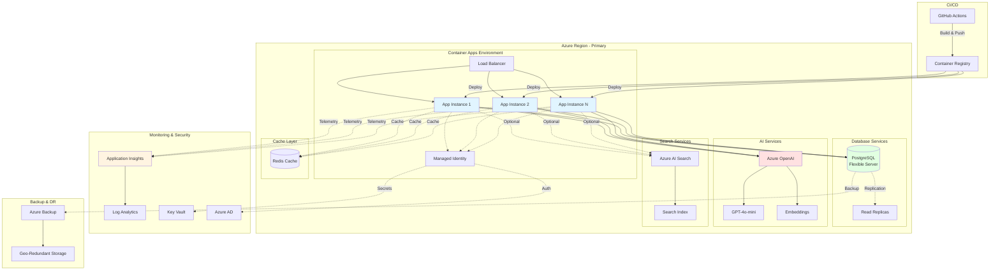

### Infrastructure Components

| Component | SKU | Auto-Scale | Availability |
|-----------|-----|------------|--------------|
| Container Apps | 1vCPU, 2GB | 2-10 replicas | 99.9% |
| PostgreSQL | Standard_B2s | Manual | 99.99% |
| Azure OpenAI | Standard | Auto | 99.9% |
| Redis Cache | Basic C0 | No | 99.9% |
| AI Search | Standard S1 | No | 99.9% |

---

## Monitoring Stack

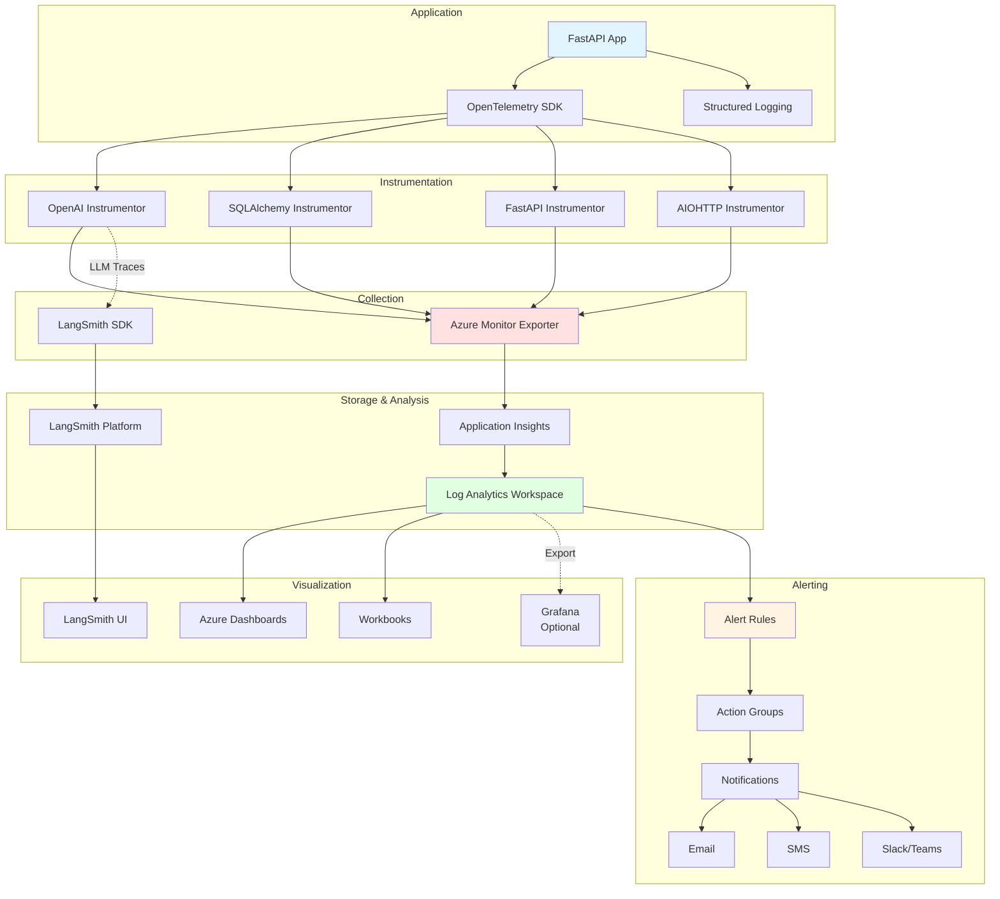

### Metriche Monitorate

#### Application Metrics
- Request rate (req/s)
- Response time (P50, P95, P99)
- Error rate (%)
- Active connections

#### AI Metrics
- OpenAI token usage (prompt/completion)
- Embedding API latency
- LLM response latency
- Function calling success rate
- Cache hit rate (se Redis abilitato)

#### Database Metrics
- Query execution time
- Connection pool utilization
- Active connections
- Vector search performance
- Full-text search latency

#### Business Metrics
- Conversations created
- Messages per conversation
- Retrieval accuracy (context relevance)
- User satisfaction (feedback)
- Documents indexed

---

## Conversation Flow con Persistenza

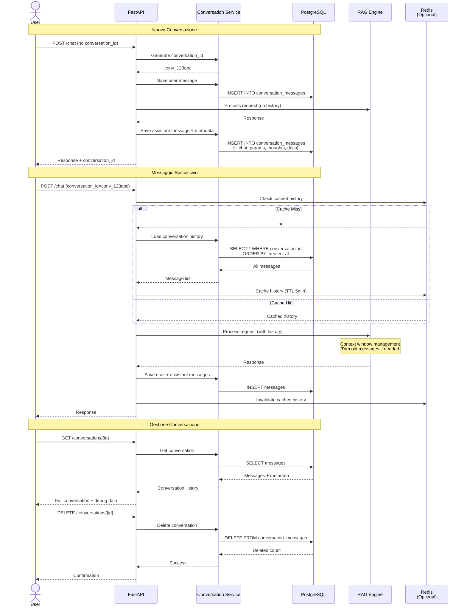

### Database Schema

```sql
-- Conversation Messages Table
CREATE TABLE conversation_messages (
    id SERIAL PRIMARY KEY,
    conversation_id VARCHAR(255) NOT NULL,
    message_role VARCHAR(50) NOT NULL,  -- 'user' | 'assistant' | 'system'
    message_content TEXT NOT NULL,
    created_at TIMESTAMP DEFAULT CURRENT_TIMESTAMP,
    
    -- Debug & Tracing Data (JSON)
    chat_params JSONB,              -- RAG parameters used
    contextual_messages JSONB,      -- Full context sent to LLM
    document_ids TEXT[],            -- Retrieved document IDs
    thoughts JSONB,                 -- Reasoning steps (AdvancedRAG)
    
    -- Indexes
    INDEX idx_conversation_id (conversation_id),
    INDEX idx_created_at (created_at DESC),
    INDEX idx_conversation_created (conversation_id, created_at DESC)
);

-- Optional: User tracking
ALTER TABLE conversation_messages 
    ADD COLUMN user_id VARCHAR(255);

CREATE INDEX idx_user_conversations 
    ON conversation_messages(user_id, created_at DESC);
```

---

## Error Handling & Retry Flow

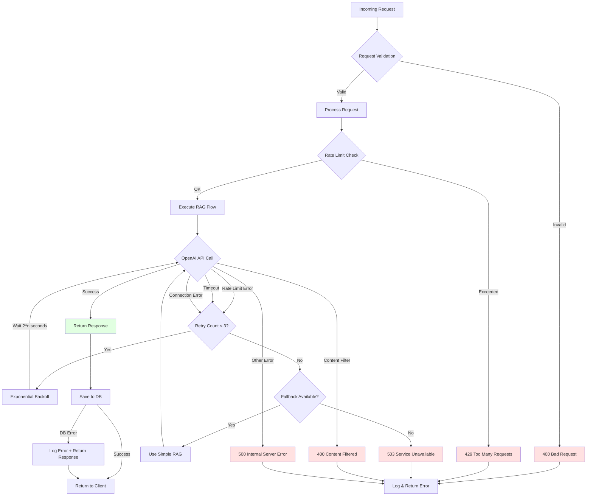

### Error Categories

| Error Type | HTTP Code | Retry? | User Message |
|------------|-----------|--------|--------------|
| Validation Error | 400 | No | "Invalid request parameters" |
| Rate Limit (App) | 429 | Yes | "Too many requests, try again later" |
| Content Filter | 400 | No | "Content flagged by safety filter" |
| OpenAI Rate Limit | 429 | Yes (auto) | Processing (transparent retry) |
| OpenAI Timeout | 504 | Yes (auto) | Processing (transparent retry) |
| Database Error | 500 | No | "Service temporarily unavailable" |
| Generic Error | 500 | No | "An error occurred, please try again" |

---

## Security Architecture

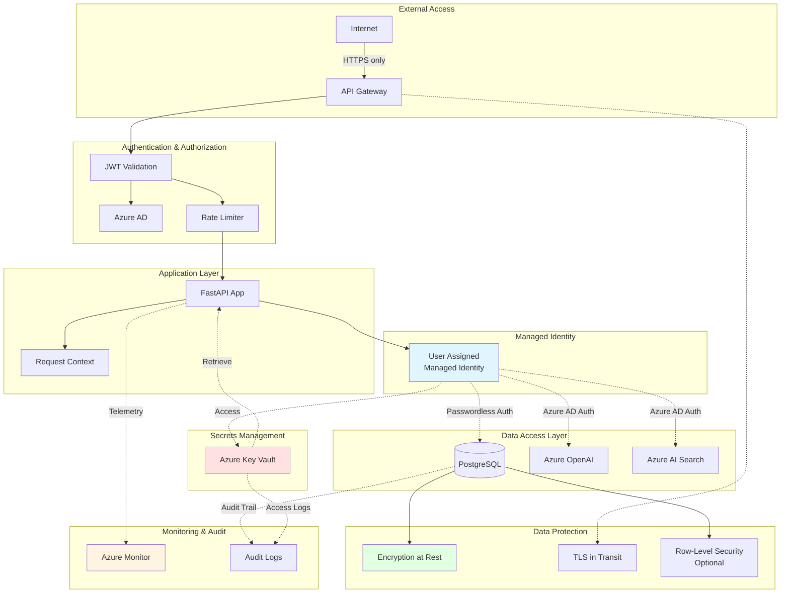

### Security Checklist

- [x] TLS 1.2+ per tutte le connessioni
- [x] Managed Identity per servizi Azure (no passwords)
- [ ] JWT authentication per API (da implementare)
- [ ] Row-Level Security su PostgreSQL (da implementare)
- [x] Content filtering Azure OpenAI
- [ ] Rate limiting per utente (da implementare)
- [x] Audit logging
- [x] Encryption at rest (Azure default)
- [ ] Input validation rigorosa (da migliorare)
- [ ] CORS policy restrittiva (da configurare)

---

## Scaling Strategy

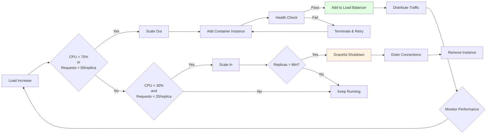

### Scaling Configuration

```yaml
scale:
  minReplicas: 2
  maxReplicas: 10
  rules:
    - name: http-scaling
      http:
        metadata:
          concurrentRequests: "50"
    
    - name: cpu-scaling
      custom:
        type: cpu
        metadata:
          type: Utilization
          value: "70"
    
    - name: memory-scaling
      custom:
        type: memory
        metadata:
          type: Utilization
          value: "80"
```

### Scaling Behavior

| Metric | Scale Out Threshold | Scale In Threshold | Cooldown |
|--------|-------------------|-------------------|----------|
| CPU | > 70% per 5min | < 30% per 10min | 5min |
| Memory | > 80% per 5min | < 40% per 10min | 5min |
| HTTP Requests | > 50 concurrent | < 20 concurrent | 3min |

**Scaling Time:**
- Scale out: 30-60 secondi (container start + health check)
- Scale in: 90-120 secondi (graceful shutdown + drain)

---

## Cost Optimization Strategy

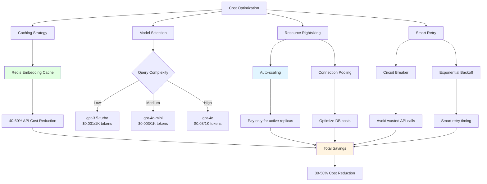

### Cost Breakdown (mensile, 10K conversazioni)

| Categoria | Senza Ottimizzazioni | Con Ottimizzazioni | Risparmio |
|-----------|---------------------|-------------------|-----------|
| Azure OpenAI | $250 | $120 (-52%) | $130 |
| Container Apps | $300 | $180 (-40%) | $120 |
| PostgreSQL | $120 | $120 (0%) | $0 |
| Redis Cache | $0 | $15 | -$15 |
| Monitoring | $100 | $80 (-20%) | $20 |
| **TOTALE** | **$770** | **$515** | **$255 (33%)** |

**Ottimizzazioni chiave:**
1. Redis caching → -52% costi OpenAI
2. Auto-scaling → -40% costi Container Apps
3. Query optimization → Migliori performance

---

## Disaster Recovery Plan

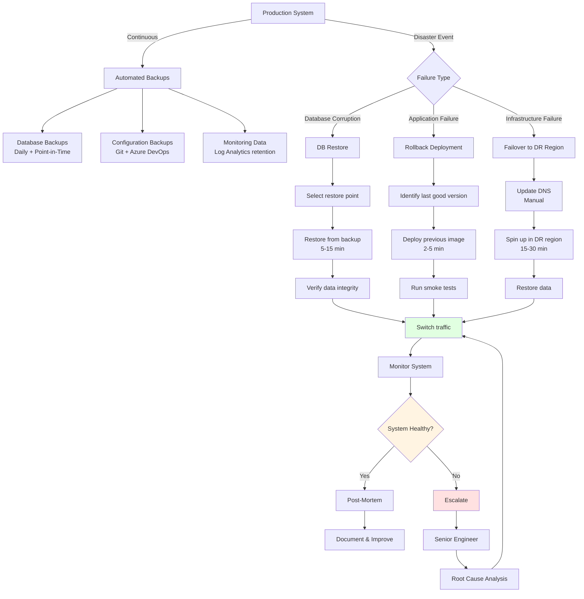

### RTO/RPO Targets

| Scenario | RTO (Recovery Time) | RPO (Data Loss) | Impact |
|----------|-------------------|----------------|--------|
| Database failure | 15 min | 5 min | Medium |
| App deployment issue | 5 min | 0 (rollback) | Low |
| Region outage | 1-2 hours | 15 min | High |
| Data corruption | 30 min | 1 hour | Medium |

**Backup Strategy:**
- Database: Continuous (point-in-time restore)
- Configuration: Git + IaC (Infrastructure as Code)
- Retention: 30 days production, 7 giorni staging

---

## Performance Optimization Roadmap

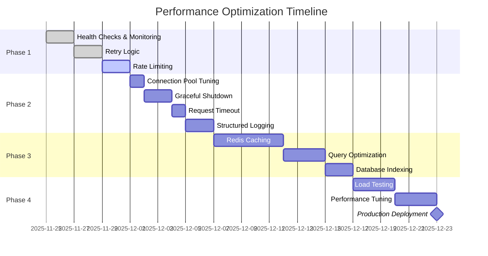

---

## Conclusioni

Questi diagrammi forniscono una visione completa dell'architettura del sistema RAG:

✅ **Architettura Generale:** Overview completo dei componenti  
✅ **Flussi RAG:** Dettagli implementativi Simple vs Advanced  
✅ **Data Flow:** Pipeline di ingestion documenti  
✅ **Deployment:** Infrastruttura Azure completa  
✅ **Monitoring:** Stack di osservabilità  
✅ **Security:** Strategie di sicurezza  
✅ **Scaling:** Auto-scaling e performance  
✅ **DR:** Disaster recovery planning  

**Usa questi diagrammi per:**
- Onboarding nuovi sviluppatori
- Documentazione tecnica
- Presentazioni a stakeholder
- Planning architetturale
- Troubleshooting e debugging

---

**Documento creato:** 2025-11-24  
**Versione:** 1.0  
**Formato:** Mermaid Diagrams (compatibile GitHub/GitLab)

